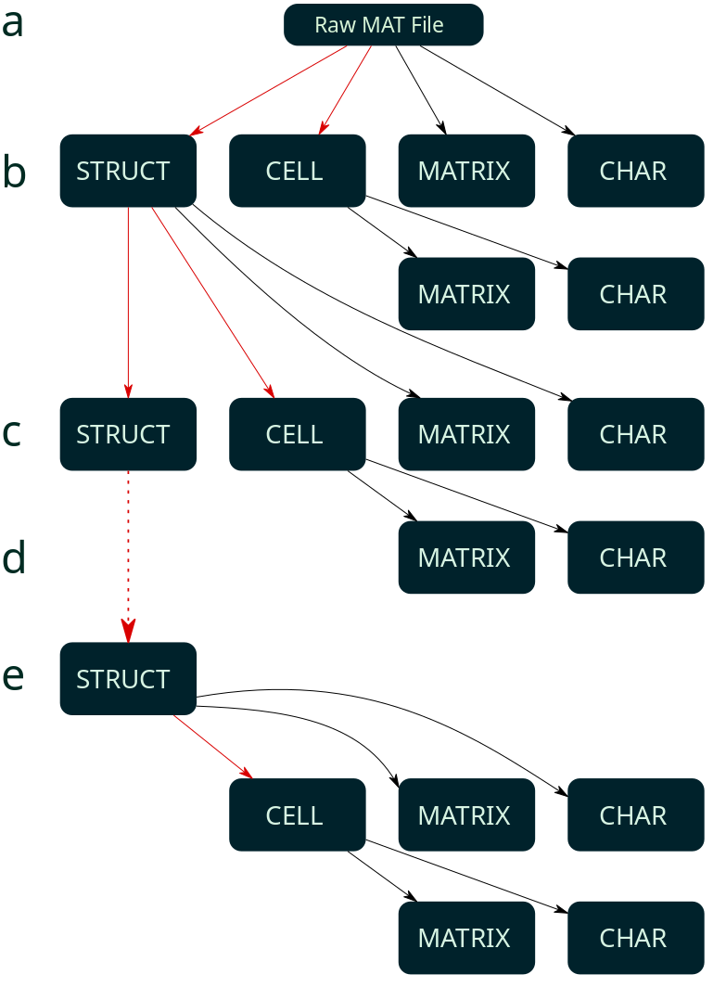

# BNDF

## Introduction

BNDF is a library for storing and processing large-scale single(multi) unit and multichannel
array recording data in a distributed manner. This library is build on top of [Apache Spark](https://spark.apache.org/) 
and [Apache Hadoop](https://hadoop.apache.org/). For storing large-scale raw data, [Apache Parquet](https://parquet.apache.org)
a columnar data structure and [Apache Hive](https://hive.apache.org/) are used on top of [Hadoop distributed file system (HDFS)](https://hadoop.apache.org/docs/current/hadoop-project-dist/hadoop-hdfs/HdfsDesign.html). 
Meta-data information of raw data, are constructed as nested [JSON](https://www.json.org/json-en.htm) files and stored in 
[mongoDB](https://www.mongodb.com). BNDF's APIs can be used in Scala, java, python, R and partially in Matlab.

### Key Advantages

BNDF provide capabilities including, but not limited to:

* Scalable data processing.
* Efficient and fast data storage for experimenters.
* Efficient and fast data processing for data analyst. 
* A major movement toward standardized data and meta-data format.   

### File Format
Currently, BNDF supports MAT files as raw input data with conditions described in [MAT File Library](https://github.com/HebiRobotics/MFL).

### Input MAT file structure

<p align="center">

</p>

<ol type="a">
  <li>Raw MAT file consist of struct, cell, matrix and char type in root level of the file.</li>
  <li>Each fields in file could have one of the illustrated structures, while struct and cell type could be nested through next level.</li>
  <li>One-level Struct type nesting, it could be nested through itself or the other types.</li>
  <li>Struct field is capable of n-level nesting.</li>
  <li>The last state of nesting struct field, resulting one of the char or matrix field being the leaf node.</li>
</ol> 

## Getting Started

### Building from Source

You will need to have [Apache Maven](https://maven.apache.org/) 3.6.0 or later installed in order to compile BNDF.

```bash
$ git clone https://gitlab.com/neuroscience-lab/bdns
$ cd bdns
$ mvn install 
```

### Run and Deployment

BNDF could run on any cluster or single machine running and configured following tools

* [Apache Hadoop](https://hadoop.apache.org/)
* [Apache Spark](https://spark.apache.org/)
* [Apache Hive](https://hive.apache.org/)
* [Apache Zeppelin](https://zeppelin.apache.org/) (Optional)
* [mongoDB](https://www.mongodb.com)

BNDF executive jar file take two parameters in the following order

* DATA_PATH
* MONGO_URI

```bash
$ spark-submit \ 
    --class com.ipm.nslab.bdns.${BNDF_MODULE_NAME} \
    --master ${SPARK_MASTER(s)_URL} | yarn | mesos \
    --deploy-mode client | cluster \ 
    --executor-memory ${SPARK_EXECUTOR_MEMORY}G \
    --total-executor-cores ${SPARK_EXECUTOR_CORES} \
    --driver-memory ${SPARK_DRIVER_MEMORY}G \
    PATH_TO_BNDF_JAR_FILE/bdns-${JAR_FILE_VERSION}.jar DATA_PATH  MONGO_URI
```

Spark-submit's parameters detailed information are available in [submitting-applications](https://spark.apache.org/docs/latest/submitting-applications.html).
For creating a private cluster and information about other runtime parameters not discussed here, see [BdnsCluster](https://gitlab.com/neuroscience-lab/bdnscluster).

### Data Locality

It is very important input data placed in the same network as cluster or, a fast access network that communicates with cluster's network. 

* Create a shared storage accessible by all the nodes in the cluster.
* Copy input data directly in HDFS using [WebHDFS REST API](https://hadoop.apache.org/docs/current/hadoop-project-dist/hadoop-hdfs/WebHDFS.html)
 or other protocol like [Mountable HDFS](https://docs.cloudera.com/documentation/enterprise/latest/topics/cdh_ig_hdfs_mountable.html).

Otherwise, data locality could create major bottlenecks while processing data with Spark.

## Documentation

BNDF documentation are available in [bdns-doc](https://bdns.readthedocs.io/).